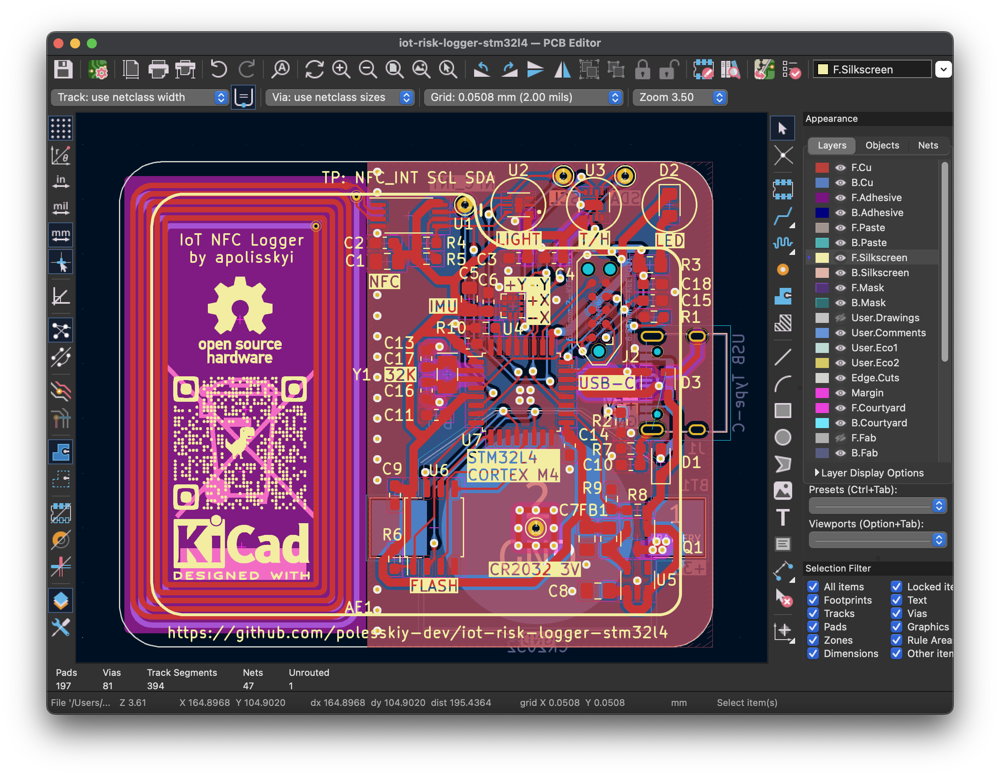
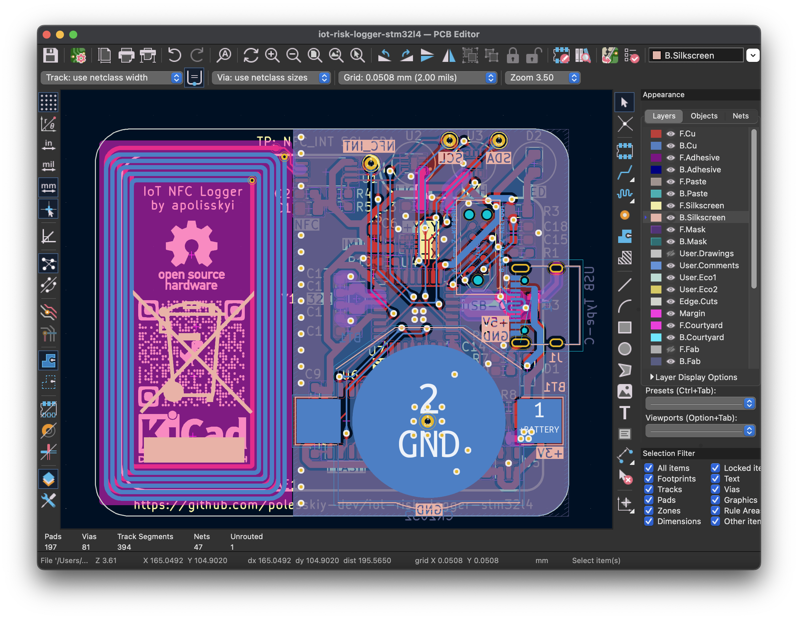

# IoT Risk Data Logger, 
## STM32L4 based

Open source & open hardware project aimed to collect environment data e.g for logistics, cold chain monitoring, last mile delivery, etc. 

https://github.com/polesskiy-dev/iot-risk-logger-stm32l4/assets/5185707/393b0768-925d-4c34-bb85-259de904c167

## Schematics & PCB
[Schematics PDF](hardware/docs/iot-risk-logger-stm32l4.pdf)




## Hardware specifications

|Item|Description|
|-|-|
| MCU | STM32L412 Cortex M4, 80MHz (48), 128K ROM, 40K RAM, TQFP32 |
| Crystal | 32.768kHz |
| Flash | QSPI 64Mbit |
| NFC | ST25DV04K |
| Temperature & Humidity | SHT30-DIS |
| Light | OPT3001 |
| IMU | LIS2DW12 |
| Power | CR2032 3V 235mAh |

## Enclosure
### Assembly


### Developed with
|||
|-|-|
| OS | MacOS, Apple Silicon |
| Schematics & PCB | KiCAD 7.0.0 |
| 3D CAD | Fusion 360 |
| Graphical MCU configure | STM32CubeMX 6.10.0 | 
| IDE | neovim, CLion |
| Hardware debug probe | J-Link EDU Mini 8.08.91 |
| Firmware debug | Segger Ozone 7.94 | 
| Firmware debug analysis | Segger SystemView 3.52 |
| Power analysis | Nordic Power Profiler Kit II |
| Oscilloscope & Logic analyzer | Digilent Analog Discovery 3 |
| Logic analyzer software | Digilent Waveforms | 

## Quick start

After clone, init submodules

```bash
git submodule update --init --recursive
```