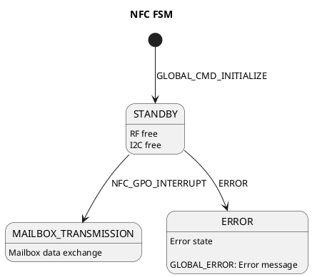

# NFC Task

### Overview

### State Diagram

  
Diagram as a code

```plantuml
@startuml
title NFC FSM
hide empty description

STANDBY: RF free\nI2C free
MAILBOX_TRANSMISSION: Mailbox data exchange
ERROR: Error state\n\nGLOBAL_ERROR: Error message

[*] --> STANDBY : GLOBAL_CMD_INITIALIZE
STANDBY --> MAILBOX_TRANSMISSION : NFC_GPO_INTERRUPT
STANDBY --> ERROR : ERROR
@enduml
```

