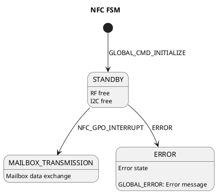
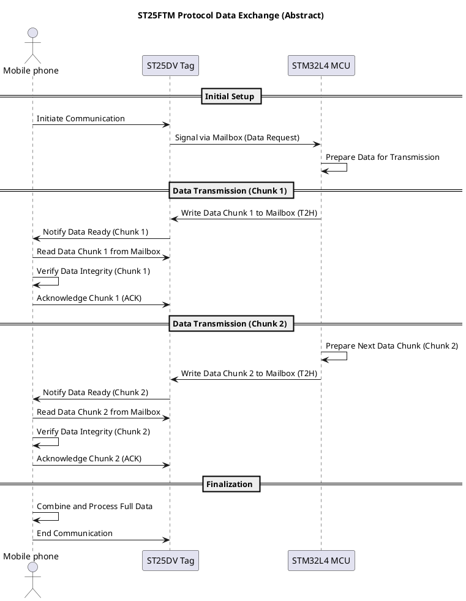
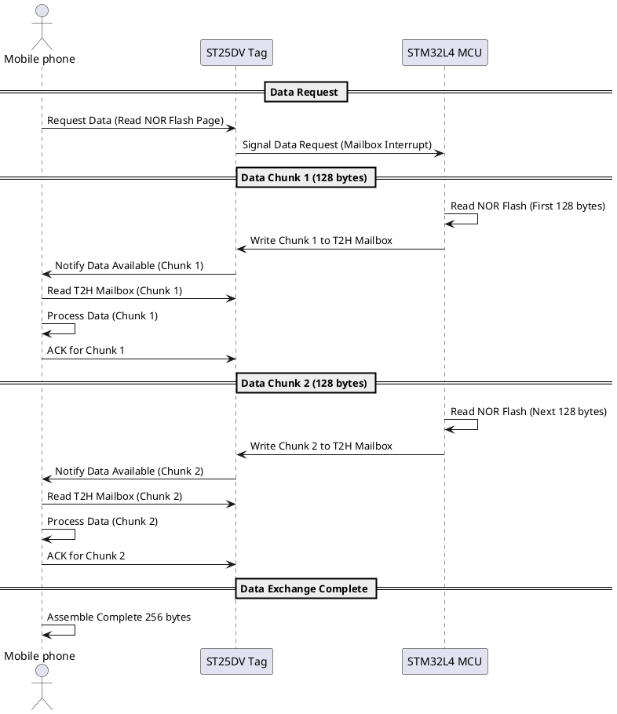

# NFC Task

### Overview

### State Diagram

  
Diagram as a code

  

### Mailbox Data Exchange Protocol (ST25FTM) Packet Format

| **Field**   | **Description**                                    |
|-------------|----------------------------------------------------|
| **Command** | 1 byte (e.g., `WRITE_PART`, `WRITE_FINAL`, `READ`) |
| **Length**  | 1 byte size of the payload in bytes                |
| **Payload** | up to 252 bytes                                    |
| **Checksum**| 2 bytes (standard CRC16 for error detection)       |  

### Mailbox Data Exchange Protocol (ST25FTM) 

  
Diagram as a code

  

### Mailbox Data Exchange Protocol (ST25FTM) for NOR Flash Data transfer

  
Diagram as a code

  

