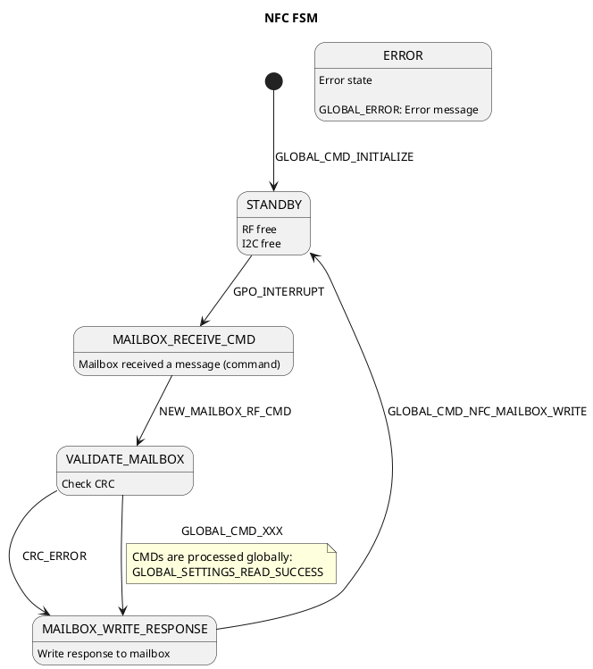

# NFC Task

### Overview

### Communication

Communication between NFC module and mobile phone is based on *client-server* model. 
NFC module acts as a server and mobile phone as a client. 
Communication is based by data exchange via *NFC Mailbox* which is 256 bytes buffer is ST25DV.

Useful payload for now is about 128 bytes. Due to I2C reading from NOR Flash and transferring data to NFC Mailbox, *double buffer* is used in MCU SRAM.

### Protocol Description
#### Request (Command) Mobile -> Device

TODO: Should I add packet number / total data size in protocol? e.g. size could be in packets

| Name       | Size, bytes | Description                                                                                                      | Example |
|------------|-------------|------------------------------------------------------------------------------------------------------------------|---------|
| CRC8       | 1           | Checksum                                                                                                         | 0xAA |
| Command ID | 1           | Command to process                                                                       | 0xC1    |
| Payload size | 1           | Useful data size in packet                                                                                       | 0x04    |
| Payload | 0...252     | Useful data, for commands it could be address to read or settings  for response it could be e,g chunk of log | 0xAA... |

#### Response Device -> Mobile
| Name             | Size, bytes | Description                                                                                                      | Example |
|------------------|-------------|------------------------------------------------------------------------------------------------------------------|---------|
| CRC8             | 1           | Checksum                                                                                                         | 0xAA    |
| Response Code ID | 1           | Response code                                                                                                    | 0xFF    |
| Payload size     | 1           | Actual data size in packet                                                                                       | 0x04    |
| Payload          | 0...252     | Actual data, for commands it could be address to read or settings  for response it could be e,g chunk of log | 0xAA... | 

#### Response Codes
| Code | Description         |
|------|---------------------|
| 0x00 | ACK (OK)            |
| 0xFF | NACK (Error -1)     |
| 0xFE | NACK CRC (Error -2) |

### State Diagram

  
Diagram as a code

  

